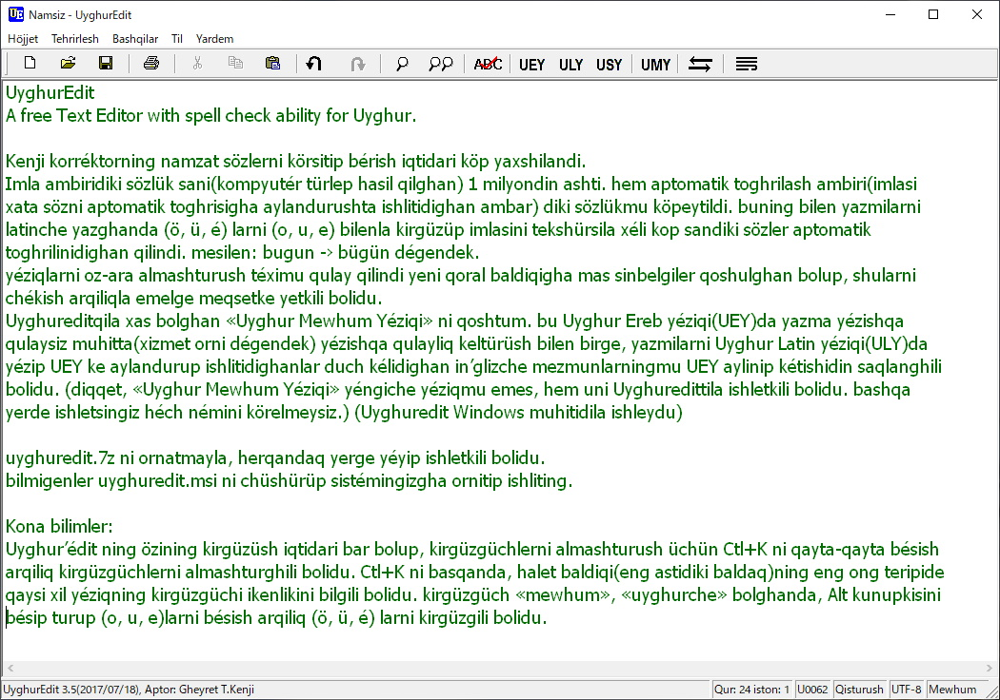

# UyghurEdit
A free Text Editor with spell check ability for Uyghur.

1. Kenji korréktorning namzat sözlerni körsitip bérish iqtidari köp yaxshilandi.
2. Imla ambiridiki sözlük sani(kompyutér türlep hasil qilghan) 1 milyondin ashti. hem aptomatik toghrilash ambiri(imlasi xata sözni aptomatik toghrisigha aylandurushta ishlitidighan ambar) diki sözlükmu köpeytildi. buning bilen yazmilarni latinche yazghanda (ö, ü, é) larni (o, u, e) bilenla kirgüzüp imlasini tekshürsila xéli kop sandiki sözler aptomatik toghrilinidighan qilindi. mesilen: bugun -› bügün dégendek.
3. yéziqlarni oz-ara almashturush téximu qulay qilindi yeni qoral baldiqigha mas sinbelgiler qoshulghan bolup, shularni chékish arqiliqla emelge meqsetke yetkili bolidu.
4. Uyghureditqila xas bolghan «Uyghur Mewhum Yéziqi» ni qoshtum. bu Uyghur Ereb yéziqi(UEY)da yazma yézishqa qulaysiz muhitta(xizmet orni dégendek) yézishqa qulayliq keltürüsh bilen birge, yazmilarni Uyghur Latin yéziqi(ULY)da yézip UEY ke aylandurup ishlitidighanlar duch kélidighan in’glizche mezmunlarningmu UEY aylinip kétishidin saqlanghili bolidu. (diqqet, «Uyghur Mewhum Yéziqi» yéngiche yéziqmu emes, hem uni Uyghuredittila ishletkili bolidu. bashqa yerde ishletsingiz héch némini körelmeysiz.)
(Uyghuredit Windows muhitidila ishleydu) 

uyghuredit.7z ni ornatmayla, herqandaq yerge yéyip ishletkili bolidu.  
bilmigenler uyghuredit.msi ni chüshürüp sistémingizgha ornitip ishliting. 

# Kona bilimler: 
Uyghur’édit ning özining kirgüzüsh iqtidari bar bolup, kirgüzgüchlerni almashturush üchün Ctl+K ni qayta-qayta bésish arqiliq kirgüzgüchlerni almashturghili bolidu. Ctl+K ni basqanda, halet baldiqi(eng astidiki baldaq)ning eng ong teripide qaysi xil yéziqning kirgüzgüchi ikenlikini bilgili bolidu.
kirgüzgüch «mewhum», «uyghurche» bolghanda, Alt kunupkisini bésip turup (o, u, e)larni bésish arqiliq (ö, ü, é) larni kirgüzgili bolidu.

  

